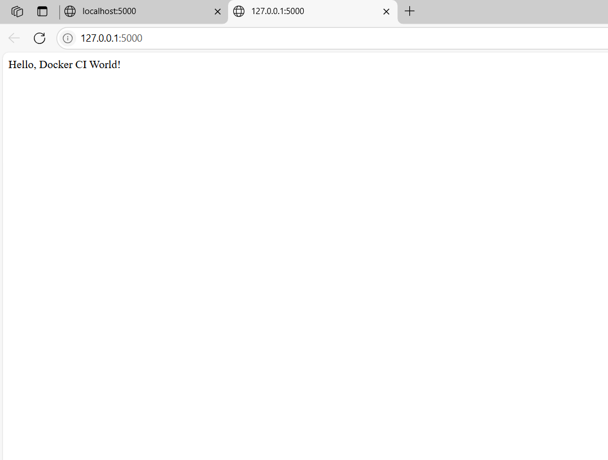

# 🚀 Flask Docker CI Example

A minimal Flask application containerized with Docker and integrated with GitHub Actions for Continuous Integration (CI). This project demonstrates how to set up automated testing and deployment pipelines for a Python web application.



---


## 🧰 Features

- 🐍 Built with Flask  
- 🐳 Dockerized for consistent development and deployment  
- ✅ Automated testing using `pytest`  
- 🔄 Continuous Integration with GitHub Actions  

---

## 🗂️ Project Structure

```
├── app.py                     # Main Flask application
├── test_app.py                # Unit tests for the application
├── Dockerfile                 # Docker configuration
├── requirements.txt           # Python dependencies
├── flask-app-ci.png           # CI pipeline diagram
└── .github/
    └── workflows/
        └── docker-ci.yml      # GitHub Actions workflow
```

---

## ⚙️ CI/CD Pipeline Overview

The GitHub Actions workflow (`docker-ci.yml`) performs the following steps:

1. **Build**: Constructs a Docker image from the `Dockerfile`.  
2. **Test**: Executes `pytest` within the Docker container to run unit tests.  
3. **Deploy**: *(Optional)* Deploys the application if tests pass successfully.

---

## 🛠️ Getting Started

### Prerequisites

- [Docker](https://www.docker.com/get-started) installed on your machine  
- [Git](https://git-scm.com/) installed  

### Installation

1. **Clone the repository**

   ```bash
   git clone https://github.com/Omokehinde-hub/flask-docker-ci.git
   cd flask-docker-ci
   ```

2. **Build the Docker image**

   ```bash
   docker build -t flask-docker-ci .
   ```

3. **Run the Docker container**

   ```bash
   docker run -p 5000:5000 flask-docker-ci
   ```

   The application will be accessible at `http://localhost:5000`.

---

## 🧪 Running Tests

To run tests inside the Docker container:

```bash
docker run flask-docker-ci pytest
```

Or run tests locally:

```bash
pip install -r requirements.txt
pytest
```

---

## 📸 CI Pipeline Diagram


---

---

## 🙌 Acknowledgements

- [Flask](https://flask.palletsprojects.com/)  
- [Docker](https://www.docker.com/)  
- [GitHub Actions](https://github.com/features/actions)

